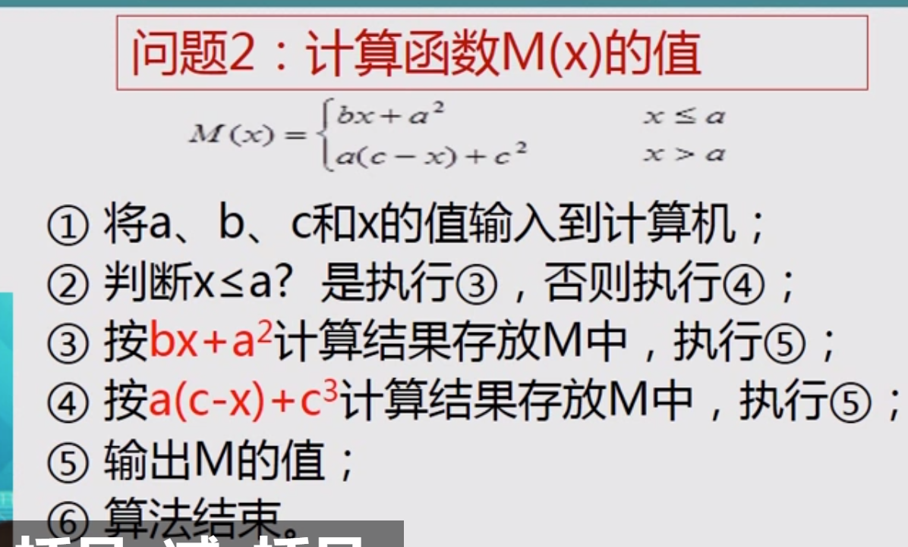
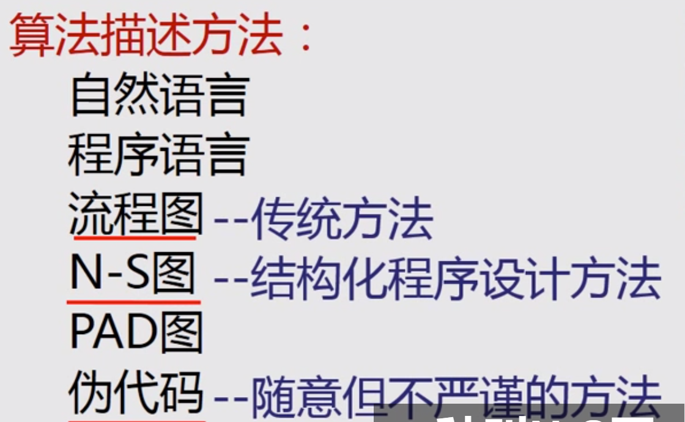

# 算法和程序笔记

1.软件通过现有程序运行

3.

4.

5.

6.

7.例子****

8.

9.

10.流程图

11.流程图举例

12.比较无序数abc问题流程图

13.算法优化

程序

1.

2.

3.基本结构

PS.选择结构一个入口一个出口

3.

a.在运行前判断做不做循环    b.运行后判断是否再循环   PS且都只有一个入口一个出口

4.取消goto

5.

6.

7.

PS健壮性是指计算机能提醒人输入时候出的错误，列入输入一周八天，计算机会提醒一周七天（输入错误）

PS高效性要考虑时间上的高效

8.

源程序文档化：用有意义的符号表示

****

9.

10.

11.程序

12.

13.

14.

15.

16.人机交互

16.格式串和变量表一一对应

17.百分号决定了输出变量的类型

17.

**分别对应三种

