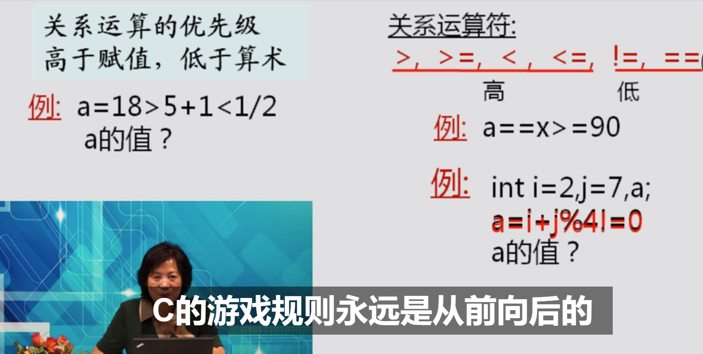
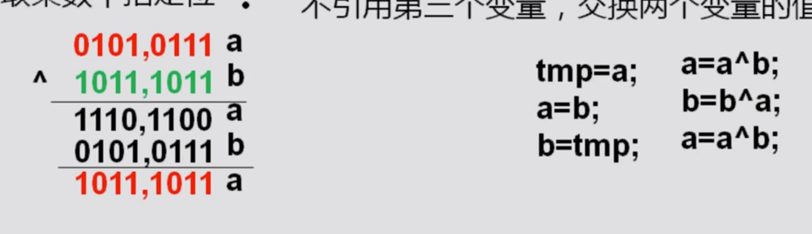
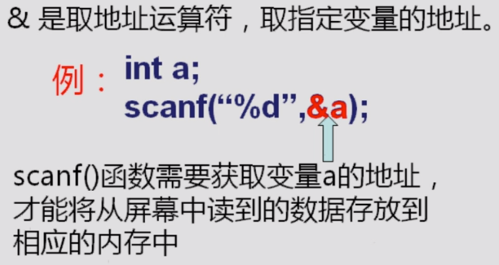

1.

表达式

余数的计算

实型数是不精确的数所以求余数无意义

复合运算符

关系比较

！=是不等于

逻辑正确与错误

j%4代表求余结果为3满足！=0则输出结果是1所以i+1=a=3

注意花括弧，若没有花括弧那么如果if成立只会执行第一句，如果if不成立就会执行第二第三句

没有括起来就默认第一句

注意PS ||（或）运算两个只要有一个为真则输入1当前面为真的话后面就无需计算提高了C效率

优先级：关系运算>关系比较>逻辑运算

条件运算符

PS相互不同则输出为异则输出1

